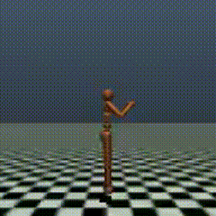
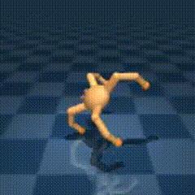
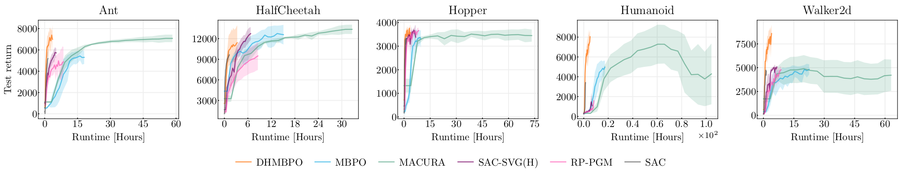

# DHMBPO

Implementation of a sample efficient and fast deep MBRL algorithm, Double Horizon
Model-based Policy Optimization (DHMBPO)
DHMBPO conceptually
combines [MBPO](https://papers.nips.cc/paper_files/paper/2019/hash/5faf461eff3099671ad63c6f3f094f7f-Abstract.html)
and
[SAC-SVG(H)](https://proceedings.mlr.press/v144/amos21a.html).

## Sample and runtime efficient implementation

This implementation works on [Gymnaisum](https://gymnasium.farama.org/) (GYM)
and [DM control](https://github.com/google-deepmind/dm_control) (DMC)
even with common hyper-parameters over all tasks,
with high sample efficiency, short runtime, and small GPU memory usage.

|        GYM Humanoid-v4         |      GYM Walker2d-v4       |        DMC cartplole-swingup_sparse         |         DMC quadruped_run         |
|:------------------------------:|:--------------------------:|:-------------------------------------------:|:---------------------------------:|
|  |  |  |  |



## Setup execution environment

At first, install suitable version of pytorch<2, then

```shell
pip install -e .
```

## Basic options

### Suites and tasks

for the [Gymnaisum](https://gymnasium.farama.org/) tasks, set `env=gym`
and `env.task_id` to one of "MBHumanoid-v0", "
MBAnt-v0", "MBHopper-v0", "MBHalfCheetah-v0" and "MBWalker2d-v0".
These are identical with "Humanoid-v4", "
Ant-v4", "Hopper-v4", "HalfCheetah-v4" and "Walker2d-v4"
except for providing known reward function usable in offline policy optimization.

Other available value for `env` is `dmc`
for [DM control](https://github.com/google-deepmind/dm_control) (DMC), `gym-robo`
for [Gymnasium-Robotics](https://github.com/Farama-Foundation/Gymnasium-Robotics)
and `myosuite` for [MyoSuite](https://github.com/MyoHub/myosuite).

## How to reproduce results in the paper

In the following, we use ``cheetah-run`` in the DMC suite.

### Main result: DHMBPO in Figure 2(a) for GYM or Figure 3 for DMC

Execute DHMBPO algorithm with option `agent=dhmbpo`.
For GYM tasks, you need to specify `env=gym` followed by
e.g., `env.task_id=MBHalfCheetah-v0`
as described in the subsection "Suites and tasks".

```shell 
python train.py agent=dhmbpo env=dmc env.task_id=cheetah-run
```

### DHMBPO w/o DR in Figure 4

Run DHBMPO without DR, conceptually corresponding to SAC-SVG(H), but with deep ensemble.
By adding `agent.training_rollout_length=5`, it runs SAC-SVG(H) of which model rollout
length=5.

```shell 
python train.py agent=svg env=dmc env.task_id=cheetah-run agent.training_rollout_length
```

### DHMBPO w/o TR in Figure 4

Run DHBMPO without TR, conceptually corresponding to MBPO.
The options are

- `agent.rollout_length=20`: The length of distribution
  rollout ("branched rollout" in the MBPO paper) is 20.
- `agent.num_policy_opt_per_step=10`: So called the UTD ratio.

```shell 
python train.py agent=mbpo env=dmc env.task_id=cheetah-run agent.rollout_length=20 agent.num_policy_opt_per_step=10
```

###           